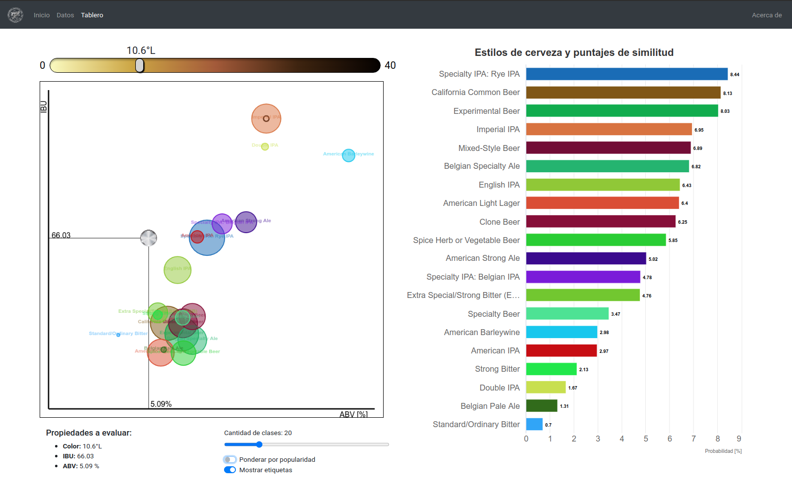
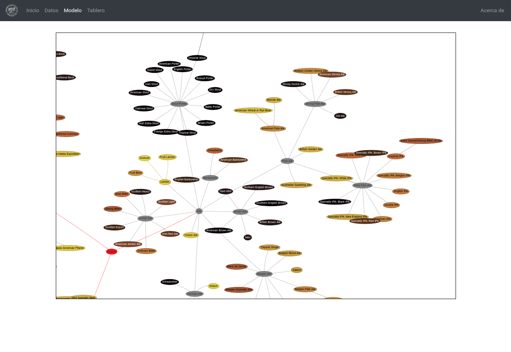

# Clasificación de estilos de cerveza según propiedades cuantitativas

## Trabajo final del curso: "Análisis Visual de Grandes Volúmenes de Datos"

Una aplicación web basada en ReactJS que asiste en la determinación del estilo de una cerveza según su color, sabor y graduación alcohólica a partir de los datos de más de 70.000 recetas del sitio [Brewer's Friend](https://www.brewersfriend.com/).

#### [Notebook Kaggle](https://www.kaggle.com/matiasmiche/brewers-friend-recipes-analysis)
Un notebook ipython para analizar los datos del conjunto original, obtener un modelo simple de clasificación y exportar al frontend de una aplicación interactiva.

#### [Demo Aplicación Web](https://vis-uns.herokuapp.com/)
Una aplicación web para organizar el análisis de los datos y simular mediante un tablero interactivo la estimación del estilo de una receta de cerveza en base a sus características.

 